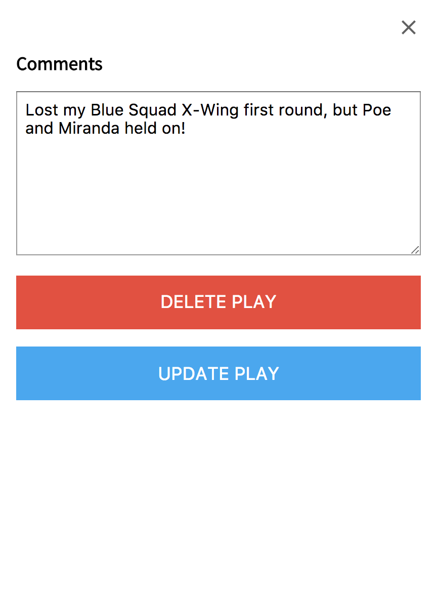

## Board Game Challenge Tracker

A Board Game Challenge is typically a challenge to play X amount of games Y times within a year. Popular challenges include 10 x 10 or 1 x 100. However, tracking these on Board Game Geek is far from mobile friendly.

My board game challenge tracker is designed to make adding plays to your challenge quick from mobile.

Aside from building a handy tool, my goal in this project is also to learn and practice using React, Redux, and Router.

Future goals for this project include hooking up to the Board Game Geek API and providing user sign up and log in.

<kbd>
  
</kbd>

<kbd>
  
</kbd>

<kbd>
  
</kbd>

###LINKS

- [Backend repo](https://github.com/TalusRocks/boardgame10-server)
